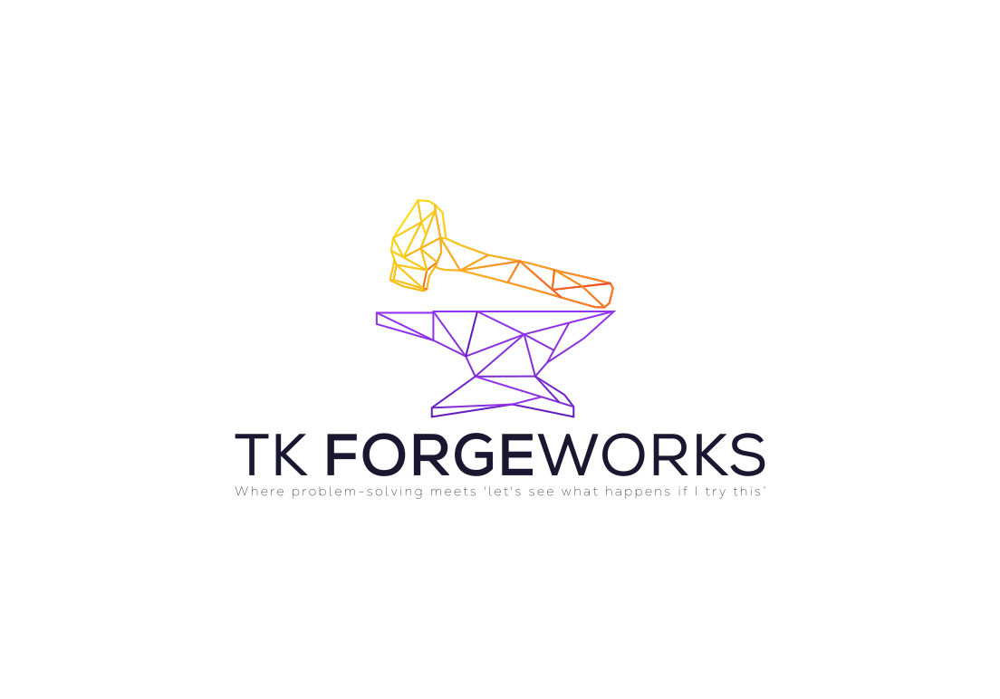

<picture>
  <source media="(prefers-color-scheme: dark)" srcset="assets/tkforgeworks-lockup-dark.svg">
  
</picture>

 

*Where problem-solving meets "let's see what happens if I try <em>this</em>."*

---

Mechanical engineer by day, herding cross-functional teams to bring transit systems to life. This is where I escape corporate committees and get to break things on purpose — hardware fixes, software experiments, and a slightly delusional belief that I can learn game development without any formal creative training.

The name's my initials plus a healthy dose of romanticizing the single-person workshop — raw materials becoming something useful through sheer stubbornness. Full story (and the actual blog) lives at **[tkforgeworks.com](https://www.tkforgeworks.com)**.

## What's actually public

| Repo | What it is |
|---|---|
| **[anvil](https://github.com/tkforgeworks/anvil)** | An RPG data-management tool for classes, items, recipes, NPCs — built because spreadsheets stopped cutting it. |
| **[claude-observability-gui](https://github.com/tkforgeworks/claude-observability-gui)** | A desktop usage-tracking tool for Claude AI, because I wanted to *see* the number go up. |
| **[.github](https://github.com/tkforgeworks/.github)** | Shared CI, branch-protection, and release-notes standards, so every repo doesn't reinvent the same YAML slightly worse. |

Everything else — including an action RPG about corporate greed that seemed like a reasonable first game project until I actually started making it — is still cooking privately. Ask me about it anyway.

## The engineering room's a little more organized than the projects

The `.github` repo tracks shared standards adopted across repos as they mature: [branch protection](https://github.com/tkforgeworks/.github/blob/main/docs/branch-protection-ruleset.md), [CI/lint validation](https://github.com/tkforgeworks/.github/blob/main/docs/ci-standards.md), and [release-notes generation](https://github.com/tkforgeworks/.github/blob/main/README.md). Consistency here is aspirational — some repos have adopted it, some haven't yet, and that's tracked too.

---

Got an idea that's either brilliant or completely unhinged? [Let's talk](https://www.tkforgeworks.com/contact) — those are my favorite kind.

Built with stubborn persistence.

